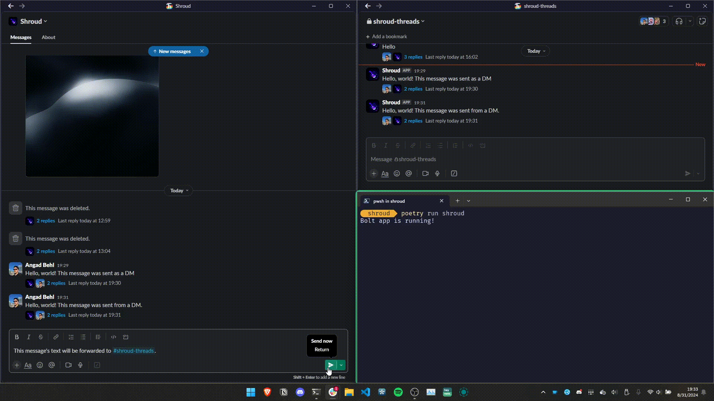

# Shroud  
Shroud is a tool allowing for reports to be made to Fire Department (FD), Hack Club's conduct team. Shroud also allows for **bidirectional communication**, allowing FD to ask follow up questions. You can choose to be **anonymous or identifiable**.
You can embed messages (including those that are private) by sending the including the link in your report. 
[](shroud.mp4)


### Features
* Send anonymous reports
    * Reports are sent to a channel where recipient(s) can view them
    * The reports can be responded to, relaying the message to the anonymous reporter's DM with the bot

### Setup
1. Create a new Slack app at [api.slack.com/apps](https://api.slack.com/apps)  
2. Create an Airtable with three columns: `dm_ts`, `forwarded_ts`, `selection`, `selection_ts`, and `dm_channel`  
3. Use the `manifest.yml` file to create it  
4. Install the app to your workspace  
5. Clone the repository  
6. Copy `example.settings.toml` to `settings.toml` and fill in the values


### Installation  
#### Docker
Run the following command to build and run the Docker container:  
```sh
docker-compose up
```
If you want to run the container in the background, use the `-d` flag:  
```sh
docker-compose up -d
```

#### Poetry
If you want to run the server without Docker, you can use [Poetry](https://python-poetry.org/):    
```sh
poetry install
poetry run python -m shroud
```

### Usage
Upon a direct message being sent to the bot, the bot will forward the message to the specified channel. The recipient(s) can then respond to the message in the thread, which will be relayed to the anonymous reporter's DM with the bot.  
To clean broken database records, run the `/shroud-clean-db` command.  


Files are not yet supported, but a file hosting service can be used to host a file and embed via a link.